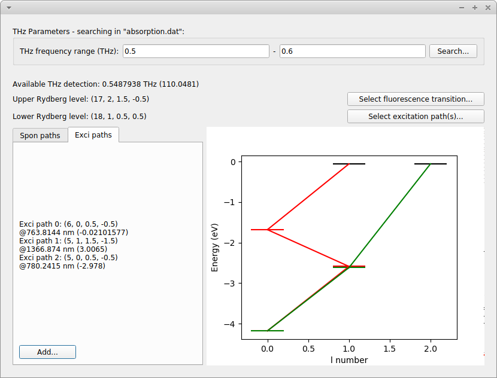

# ARC-calculator

Calculation of absorption spectrum and spontaneous radiation based on the [ARC](https://github.com/nikolasibalic/ARC-Alkali-Rydberg-Calculator) package.

Once data files, including "absorption.dat", "spontaneous.dat" and "levels.dat", are created by running the ipynb script, a GUI tool built with PyQt5, "path-select.py", can help design the transition paths for THz sensing application.

